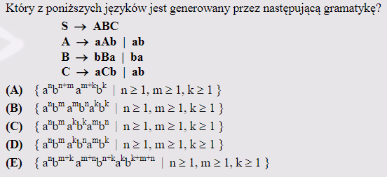
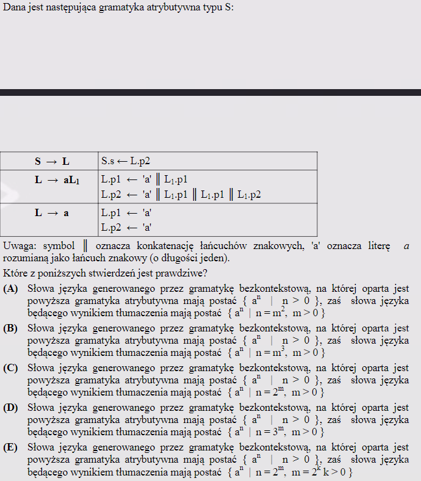
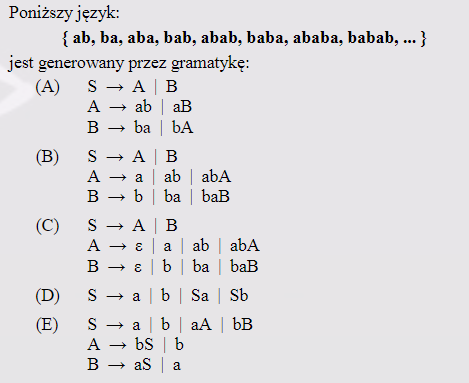
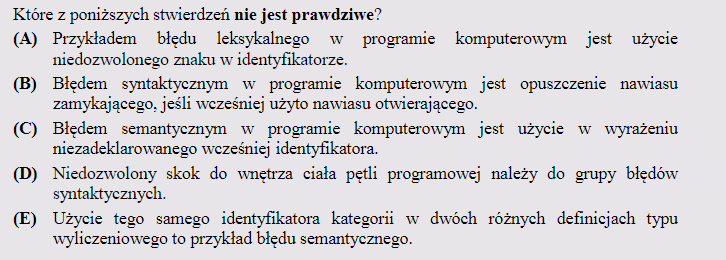
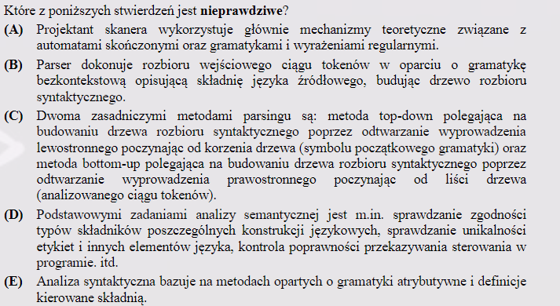

# Języki formalne i kompilatory

## Automaty

- Automat skonczony i jak on działa
- Automat deterministyczny i nie deterministyczny
- Automat zupełny i nie zupełny

### Zadania

- Zdjęcie automatu i trzeba wyznaczyć jaki język jest akceptowany przez ten automat

- Zdjęcie automatów i trzeba wyznaczyć jaki automat jest deterministyczny, zupełny

- Zdjęcie automatów i trzeba wyznaczyć wyrażenie regularne do każdego

## Wyrażenie regularne

- Wyrażenie regularne i jak oni działa

### Zadania

- Napisane wyrażenie regularne i trzeba wyznaczyć jakie wszystkie łańcuchy akceptuje

- Jest opisany łańcuch słowami i trzeba wyznaczyć jakie wyrażenie regularne mu pasuje

- Zdjęcie automatów i trzeba wyznaczyć wyrażenie regularne do każdego

- Wyznaczenie tożsamości

## Gramatyka formalna

- Co to jest gramatyka formalna i jak ona generuje
- Co to jest Terminal i Nie Terminal
- Wszystkie metody generowania (./img/i, II, III, IV)
- lewostronna generacja i prawostronna generacja

### Zadania

- Zdjęcie gramatyki formalnej i trzeba wyznaczyć jaki język generuje

- nie ma opisu

- Napisana kolejka łańcuchów i trzeba wyznaczyć, która gramatyka to generuje

## Fazy działania kompilatorów

### Parser

- Co to jest parser i do czego służy
- Jakie błędy wraca

#### Zadania

- Napisane pytanie `Głównym zadaniem parsera jest:` i trzeba wybrać do czego służy parser

- Napisane pytanie, w którym trzeba wybrać do czego nie służy parser

- Trzeba wyznaczyć, jakie błędy są generowane przez parsera

### Skaner

- Co to jest skaner i do czego służy
- Jakie błędy wraca

#### Zadania

- Napisane pytanie `Głównym zadaniem skanera jest:` i trzeba wybrać do czego służy skaner

- Napisane pytanie, w którym trzeba wybrać do czego nie służy skaner

- Pytanie, w którym trzeba wybrać nie prawdziwą odpowiedź związaną z działaniem parsera, skanera, analizatora semantycznego

## Kompilacja i interprytator

- rozumieć do czego one służą

### Zadanie

- Głowny fazy działania kompilatora
- Co to jest skaner (Analizator leksykalny)?
- Co to jest parser (Analizator składniowy | analiza syntaktyczna)?
- Co to jest semantic analyzer (Analizator semantyczny)?
- Błędy wszystkich faz
- Analiza leksykalna (skaner)
- Analiza syntaktyczna (parser)
- Analiza semantyczna
- Kompilacja
- Interpretacja
- Co to jest automat ze stosem?
- LL i LR technologii parsing-u
- LL Parsowanie:
- LR Parsowanie:
- Co to jest technologia top-down(LL)?
- Co to jest technologia bottom-up(LR)?
- Co to jest LL(1), FIRST, FOLLOW, SLR(1), LR(1)?
- LL(1)
- FIRST
- Kiedy jest to używane?
- FOLLOW
- SLR(1)
- LR(1)
- Optymalizacja kodu pośredniego.
- Gramatyka atrybutowa